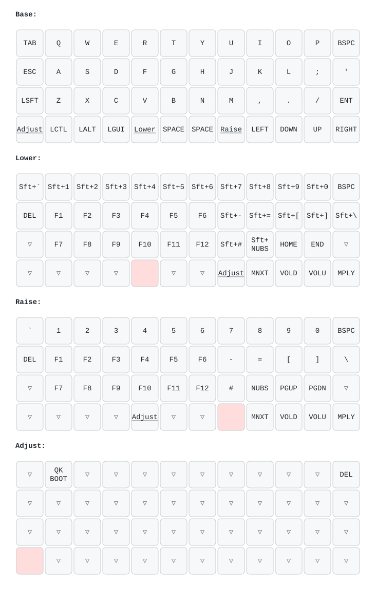

# planck-rev5-vial

A [Vial](https://get.vial.today/) port for the **OLKB Planck rev5**, which upstream
`vial-qmk` does not ship a keymap for.

Vial makes the keyboard remappable at runtime — layers, tap dance, combos and key
overrides are edited in a GUI and take effect immediately, with no recompile and no
reflash. Unlike VIA, the keyboard definition is embedded in the firmware, so the GUI
works on any machine, offline, with nothing to sideload.

## Why this repo exists

`vial-qmk` ships Vial keymaps for `planck/rev6_drop`, `planck/rev7` and `planck/light`,
but not for `rev5`. The matrix is identical to the supported revisions, so the port is
small: a `vial.json`, a keyboard UID, an unlock combo, and a `rules.mk` trimmed to fit
the rev5's ATmega32U4.

## Quick start

```bash
git clone git@github.com:dhruvthanki/planck-rev5-vial.git
cd planck-rev5-vial
./scripts/setup.sh     # toolchain + qmk CLI + vial-qmk clone + symlink + udev rules
./scripts/build.sh     # -> ~/vial-qmk/planck_rev5_vial.hex
./scripts/flash.sh     # press the reset button on the back of the PCB when prompted
```

Then install the [Vial GUI](https://get.vial.today/) (Linux ships an AppImage --
`chmod +x` and run) and open the keyboard.
Vial asks for the **security unlock combo** before it will let you edit:

> **Hold Esc + Space** (matrix positions `1,0` and `3,5`)

`setup.sh` symlinks `keymap/` into the vial-qmk tree, so this repo stays the single
source of truth — edit here, build there.

## Checking the board

`keymap.c` is only the seed. Once you edit anything in Vial the live layout lives in
the keyboard's EEPROM and the two diverge silently, so there is a script that reads
the truth back off the board:

```bash
./scripts/dump-keymap.py          # audit for dead keys
./scripts/dump-keymap.py --all    # plus the full keymap, all layers
```

It flags switches mapped to `KC_NO` and keycodes whose feature is not compiled in --
the second kind look normal in the Vial GUI but do nothing when pressed. See
[docs/constraints.md](docs/constraints.md#keycodes-that-silently-do-nothing).

## Target hardware

Read off the board itself, and cross-checked against `keyboards/planck/rev5/keyboard.json`
in vial-qmk:

| Property | Value |
| --- | --- |
| USB VID:PID | `0x03A8:0xAE01` |
| Device version | `0.0.5` |
| MCU | ATmega32U4 (28672 bytes usable flash, 1 KB EEPROM) |
| Bootloader | `qmk-dfu` |
| Matrix | 4 rows x 12 cols, COL2ROW |
| Layouts | `LAYOUT_ortho_4x12`, `LAYOUT_planck_1x2uC` |
| This board | **MIT** -- one 2u spacebar (`layout_options = 0`) |
| Backlight pin | B7 (single colour; no RGB on this revision) |

If your board reports a different PID, it is not a rev5 — check
`lsusb`/`/sys/bus/usb/devices/*/idProduct` and use the matching revision instead.

The keymap uses `LAYOUT_ortho_4x12` with `KC_SPC` on both `3,5` and `3,6`, so the same
firmware works whether your board is built **MIT** (one 2u spacebar) or **grid**
(two 1u keys). `vial.json` exposes that as a layout option in the GUI.

## What the firmware includes

Enabled: Vial + VIA protocol, dynamic keymaps and macros, **tap dance**, **combos**,
**key overrides**, caps word, layer lock, repeat key, tri layer, NKRO,
extrakey (media/volume), bootmagic, send string, **mousekey**,
**dynamic tapping term** (`DT_UP`/`DT_DOWN`/`DT_PRNT` for runtime hold-vs-tap tuning)
and grave escape.

All of the above was read back from the build with
`make planck/rev5:vial:dump_vars`, not assumed.

Disabled, deliberately — see [docs/constraints.md](docs/constraints.md):

| Setting | Why |
| --- | --- |
| `AUDIO_ENABLE = no` | No piezo populated on this board |
| `BACKLIGHT_ENABLE = no` | No LEDs populated |
| `RGBLIGHT_ENABLE = no` | rev5 has no RGB |
| `CONSOLE_ENABLE = no` | Debug feature; also frees a USB endpoint for raw HID |
| `QMK_SETTINGS = no` | Flash budget — costs the Vial settings tab |
| `MAGIC_ENABLE = no` | Flash budget |
| `SPACE_CADET_ENABLE = no` | Flash budget |
| `MUSIC_ENABLE = no` | Needs audio hardware |
| `AUTO_SHIFT_ENABLE` off | Pulled in by `QMK_SETTINGS`; goes away with it |

Re-enable anything you have hardware for — but check the size report, the budget is tight.

## Current build size

```
Flash:   26530 / 28672 bytes  (92%, 2142 free)
Layers:  4 dynamic  (EEPROM-limited, not flash-limited)
```

## Layout

Four layers, following the stock Planck arrangement. Everything below is only the
*starting point* — once Vial is running you remap in the GUI and never touch this file
again.



Regenerate after any layout change:

```bash
./scripts/render-layout.py      # layouts/*.vil -> .yaml + .svg
```

`Lower` = `MO(1)` (symbols, F1–F12), `Raise` = `MO(2)` (numbers, brackets),
holding both reaches `layer 3`, as does the dedicated `Adjust` key at bottom left.
Layer 3 carries `QK_BOOT` -- but note Vial firewalls that keycode unless the board is
unlocked (`vial.c:81`), so use the physical reset button unless you have entered the
unlock combo.

## Repo layout

```
keymap/          the Vial keymap; symlinked into vial-qmk by setup.sh
  config.h         keyboard UID, layer count, unlock combo
  keymap.c         the four default layers
  rules.mk         feature switches and the flash budget
  vial.json        keyboard definition embedded into the firmware
scripts/         setup / build / flash
  dump-keymap.py   read the live keymap off the board and audit it
  render-layout.py render a .vil export to an SVG diagram
layouts/         .vil exports (EEPROM backups) and generated diagrams
docs/
  hardware.md      how the board was identified from a running system
  constraints.md   the flash and EEPROM budget, and what was traded away
```

## Credits and licence

`keymap.c` and `vial.json` are derived from the `planck/light` Vial keymap in
[vial-qmk](https://github.com/vial-kb/vial-qmk), originally by Jack Humbert and
contributors. GPL-2.0-or-later, same as QMK — see [LICENSE](LICENSE).
